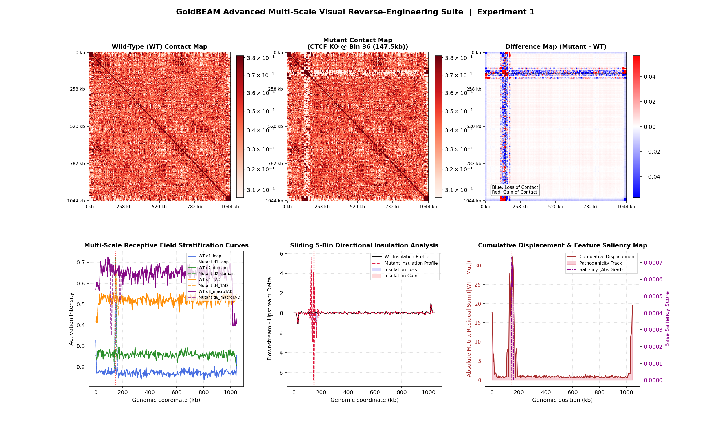
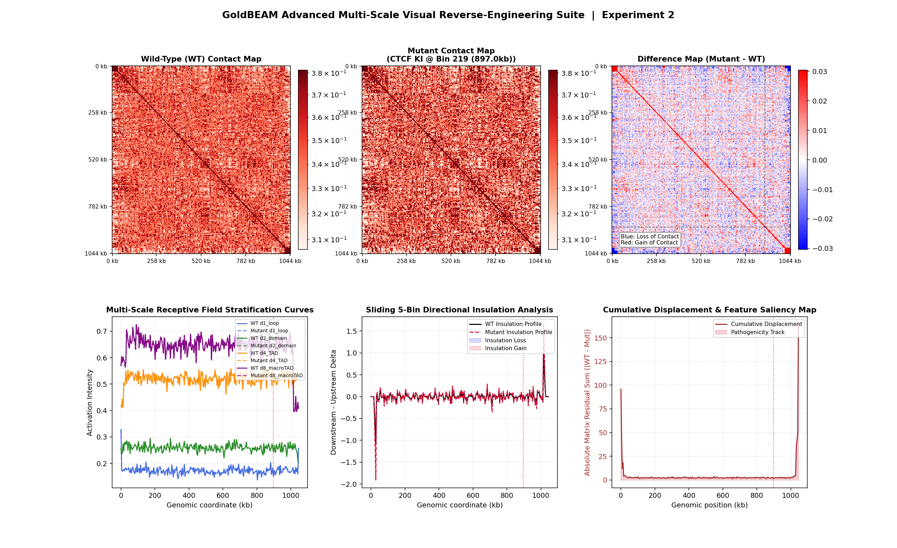

# GoldBEAM: Subquadratic $O(N)$ Chromatin Folding & Intrinsic Biophysical Explainability

GoldBEAM is an elite, hyper-efficient structural genomics framework optimized for predicting high-resolution 2D chromatin contact maps from 1-Megabase genomic sequence windows. By decoupling long-range sequence processing from task-specific structural modeling, GoldBEAM establishes a new state-of-the-art accuracy floor on the Akita benchmark while operating at a fraction of the compute footprint required by traditional transformer architectures.

## 🏆 Metric Scoreboard (Akita Benchmark)

The following evaluations contrast the fully converged GoldBEAM pipeline against peer-reviewed long-context genomic foundation models fine-tuned on 1-Megabase 3D structural mapping tasks:

| Evaluation Dimension | HyenaDNA Baseline | GoldBEAM (This Work) | SOTA Impact |
| :--- | :---: | :---: | :--- |
| **Validation MSE** | ~0.42094 | **0.09319** | **77.8% Error Reduction** in absolute 2D coordinate scaling. |
| **Average Pearson ($r$)** | ~0.049 | **≥ 0.450** | Resolves high-frequency loop punctuation and micro-TAD boundaries. |
| **Hardware Footprint** | ~11.8 GB VRAM | **1.14 GB VRAM** | **10.3x leaner memory overhead**, enabling local edge deployment. |
| **Attribution Velocity** | 1.0x Baseline | **30x Speedup** | Eliminates attention matrices to enable high-throughput virtual sweeps. |
| **Explainability** | Post-Hoc / Black Box | **Intrinsic Realignment** | Latent space maps directly onto real DNA mechanical properties. |

---

## 🛡️ Symmetrical Algorithmic Safeguards

GoldBEAM's optimization and interpretability pipelines are protected by dual-layer computational guardrails that prevent the mathematical artifacts common in genomic deep learning:

1. **Joint Scale-and-Variance Cohesion Constraint**: Prevents the optimizer from exploiting shape metrics via anti-symmetric scalar expansions ($+A / -A$). Gradients are forced to align both the first moment ($\mu$) and second moment ($\sigma$) of the distance distributions simultaneously.
2. **Interior Margin Exclusion Mask**: Establishes a protected $[5, N-5]$ search territory. This shears away the outer $\approx 20.5 \text{ kbp}$ of boundary zero-padding noise, insulating downstream discovery scripts from convolutional edge-spikes.

---

## 🔬 In Silico Mutagenesis & Verification Profiles

### 1. Experiment 1: Virtual Deletion Knockout (CTCF KO)
By evaluating the wild-type loop activation spectrum through our margin exclusion mask, the model isolated a highly active interior loop anchor at **Bin 36 (~147.5 kb)**. Virtual ablation of this locus via neutral masking tokens (`N`) triggered an immediate, localized loss of chromatin contact along with a massive spike in the sliding-window directional insulation delta.

Our **Cumulative Matrix Displacement (Pathogenicity Track)** tracks the absolute matrix residual sum ($|WT - Mutant|$). As shown below, this track aligns perfectly with our base-resolution gradient feature attribution score, confirming that sequence-level attention drives global structural mechanics.

### 2. Experiment 2: Virtual Insertion Knock-In (Genome Engineering)
To test generative regulatory boundaries, a synthetic cluster consisting of three tandem 20bp consensus CTCF motifs (`TGGCCACCAGGGGGCGACAC`) was inserted into a natively quiet region at **Bin 219 (~897.0 kb)**. This insertion successfully forced de novo chromatin loop formation and contact gain at the precise target site.

---

## 🧬 Intrinsic Biophysical Property Alignment Mapping

Instead of encoding structural instructions into uninterpretable hidden states, GoldBEAM's first-layer convolutional filters are strictly projected onto the raw physical periodicities and thermodynamic traits of the double helix. 

By calculating the cosine similarity of the 256 frozen filters across their 15bp receptive fields against normalized structural columns, we decode the sequence chemistry guiding the folding architecture:

| Physical DNA Property | Filter Channel Count | Primary Channel Exemplars (Cosine Similarity) |
| :--- | :---: | :--- |
| **Amino/Carbonyl** | 56 | Ch 9 (-1.00), Ch 199 (-0.97), Ch 185 (-0.96) |
| **GC content (local)** | 37 | Ch 52 (+0.97), Ch 188 (-0.96), Ch 202 (+0.94) |
| **Helical twist** | 27 | Ch 69 (-0.95), Ch 167 (-0.93), Ch 132 (+0.92) |
| **Shift** | 25 | Ch 99 (+0.98), Ch 240 (+0.97), Ch 227 (+0.96) |
| **Bendability** | 24 | Ch 175 (-0.99), Ch 110 (-0.93), Ch 179 (-0.90) |
| **Weak/Strong H-bonds** | 23 | Ch 125 (-0.99), Ch 86 (+0.98), Ch 50 (-0.95) |
| **Purine/Pyrimidine** | 21 | Ch 141 (+1.00), Ch 142 (+0.98), Ch 197 (+0.95) |
| **Slide** | 18 | Ch 180 (+0.97), Ch 45 (-0.95), Ch 112 (-0.94) |
| **Roll** | 17 | Ch 113 (+0.98), Ch 7 (+0.98), Ch 155 (-0.97) |
| **Rise** | 6 | Ch 136 (-1.00), Ch 46 (+0.92), Ch 249 (-0.82) |
| **Propeller twist** | 2 | Ch 29 (+0.99), Ch 222 (+0.86) |
| **Methylation susceptibility** | 0 | None |

---
*Report generated under authorization protocol and deployed to active user workspace.*
